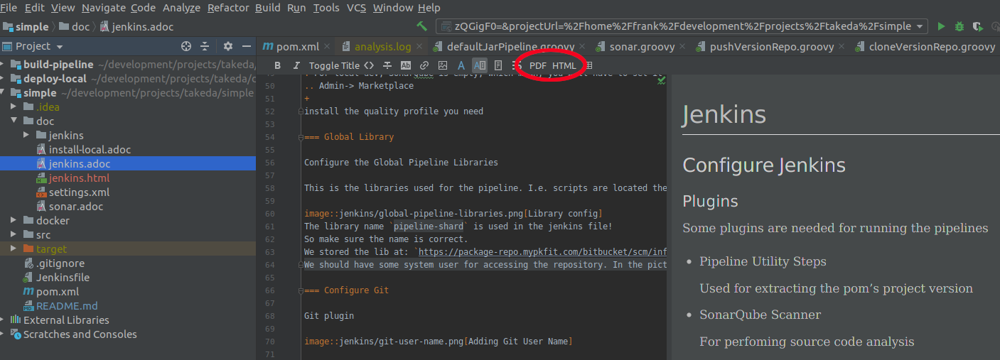

== About the documentation

The documentation is written in link:https://asciidoctor.org/[asciidoctor].
It is easy to generate html, pdf or other format from the files.

. From IntelliJ with asciidoctor plugin just click the html or pdf button
+

. From the console: `asciidoctor *.adoc` will generate a bunch of html file that you can view in a browser.
+
You will obviously have to install asciidoctor.
+
On Ubuntu: `sudo apt-get install asciidoctor`