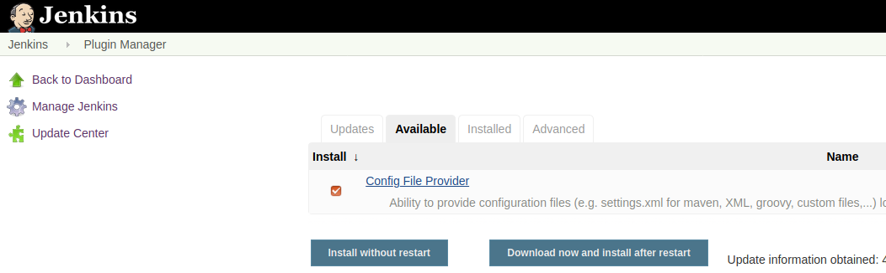
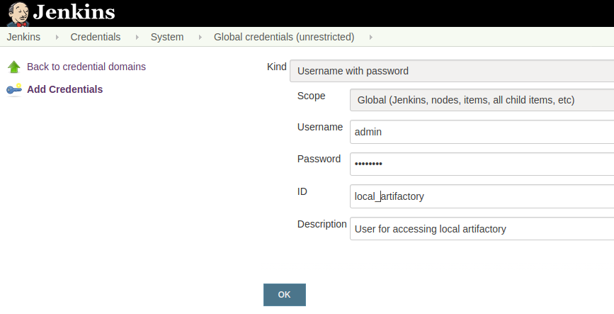

=== Artifactory

In order to deploy artifacts to Artifactory, we need a `settings.xml` as we deploy with maven.

Install the Create File Provider plugin

. Go to plugin manager
+
image::jenkins/plugin-manager.png[]

. Install Config File Provider plugin
+

Add credentials for Artifactory

. Create global scoped credentials (see Bitbucket or Sonar)

. Initial username/password: admin / password
+

Configure Settings.xml

. From the main Jenkins dashboard, select Manage Jenkins.
+
image::jenkins/configure-jenkins.png[]

. Select the Managed files plugin.
+
image::artifactory/config-file.png[Config Files]
. Select Add a new Config.

. Select Maven settings.xml.
+
:figure-caption!:
.The id must be `settings_xml_artifactory` as it will be used in the scripts
image::artifactory/manage_files.png[Select maven settings]

.. Select Server Credentials Add.
.. Enter `artifactoryId` for ServerId.
This matches the <server><id> section from your settings.xml file.
+
image::artifactory/configure_settings.png[Configure settings.xml]
+
+
The settings.xml file must look like

    <settings xmlns="http://maven.apache.org/SETTINGS/1.1.0"
        xmlns:xsi="http://www.w3.org/2001/XMLSchema-instance"
        xsi:schemaLocation="http://maven.apache.org/SETTINGS/1.1.0 http://maven.apache.org/xsd/settings-1.1.0.xsd">
        <servers>
            <server>
                <id>artifactoryId</id>
            </server>
        </servers>
    </settings>

. The artifactoryId `artifactoryId` is used in the deploy script

. The id `settings_xml_artifactory` is used in the deploy script

==== Pitfall for local Artifactoy

For local use, we also need to connect to Takeda's Artifactory.
Therefore, we will also need to access that server.

. Change your settings.xml file
+
    <?xml version="1.0" encoding="UTF-8"?>
    <settings xmlns="http://maven.apache.org/SETTINGS/1.0.0"
    xmlns:xsi="http://www.w3.org/2001/XMLSchema-instance"
    xsi:schemaLocation="http://maven.apache.org/SETTINGS/1.0.0 http://maven.apache.org/xsd/settings-1.0.0.xsd">
        <pluginGroups>
        </pluginGroups>
        <proxies>
        </proxies>
        <servers>
            <server>
                <id>artifactoryId</id>
            </server>
            <server>
                <id>release</id>
            </server>
        </servers>
        <mirrors>
        </mirrors>
        <profiles>
            <profile>
                <activation>
                    <activeByDefault>true</activeByDefault>
                </activation>
                <repositories>
                    <repository>
                        <snapshots>
                            <enabled>false</enabled>
                        </snapshots>
                        <id>release</id>
                        <name>libs-release</name>
                        <url>https://package-repo.mypkfit.com/artifactory/libs-release</url>
                    </repository>
                </repositories>
            </profile>
        </profiles>
    </settings>

. Add the credentials for the release server