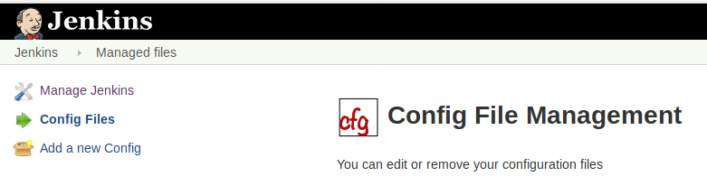
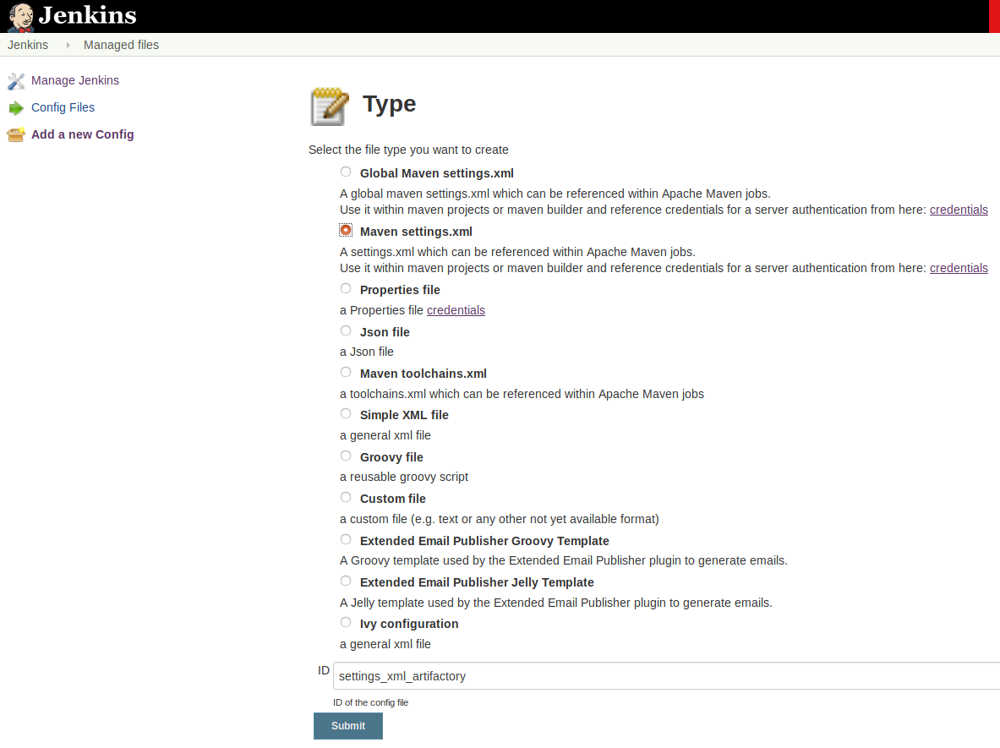
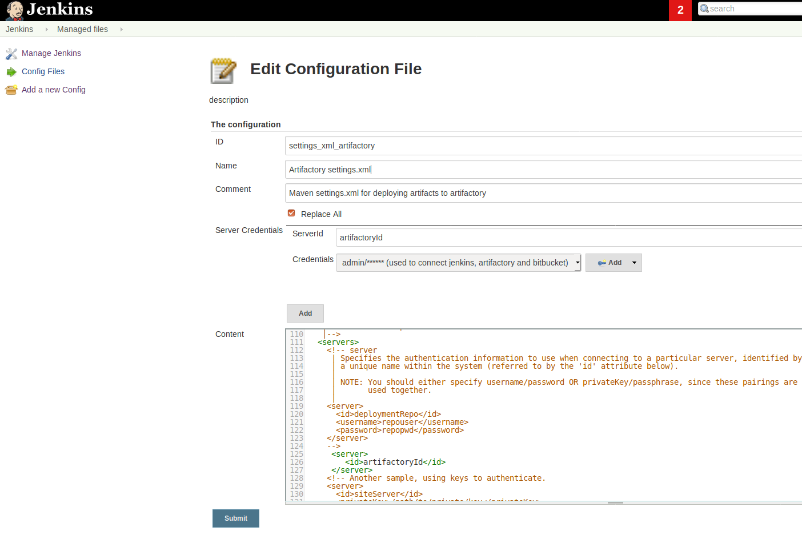

=== Artifactory

In order to deploy artifacts to Artifactory, we need a `settings.xml` as we deploy with maven.

=== Import the Maven settings.xml file

. You will need to create credentials, user name password as for bit bucket
. Import settings xml
. User the settings.xml in the pipeline

To import your Maven settings file, follow the steps below.

. From the main Jenkins dashboard, select Manage Jenkins.
. Select the Managed files plugin.
This opens the Config File Management dashboard.
+

. Select Add a new Config.
. Select Maven settings.xml and click Submit.
+

. Select Server Credentials Add.
. Enter `artifactoryId` for ServerId.
This matches the <server><id> section from your settings.xml file.
. Enter the username and password pair from the downloaded settings.xml file in the Credentials field.
. Remove the username and password pair from the downloaded settings.xml file and copy the resulting file into the Content field.
+

+
Add a `Maven settings.xml` file type.
Give an Id `settings_xml_artifactory`.
The settings file is used for deploying to Artifactory.
You will need it later on.
+
The settings.xml file must look like

    <settings xmlns="http://maven.apache.org/SETTINGS/1.1.0"
        xmlns:xsi="http://www.w3.org/2001/XMLSchema-instance"
        xsi:schemaLocation="http://maven.apache.org/SETTINGS/1.1.0 http://maven.apache.org/xsd/settings-1.1.0.xsd">
        <servers>
            <server>
                <id>artifactoryId</id>
            </server>
        </servers>
    </settings>

. The artifactoryId `artifactoryId` is used in the deploy script.
. the id `settings_xml_artifactory` is used in the deploy script
