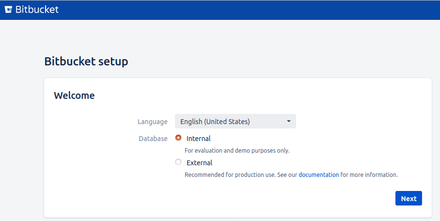
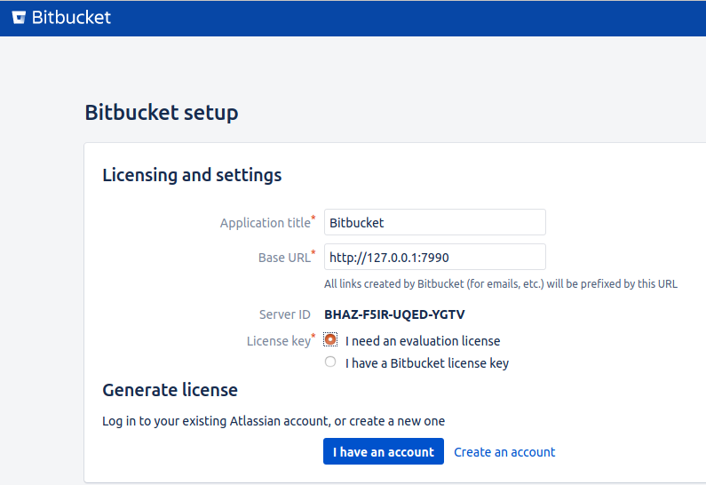
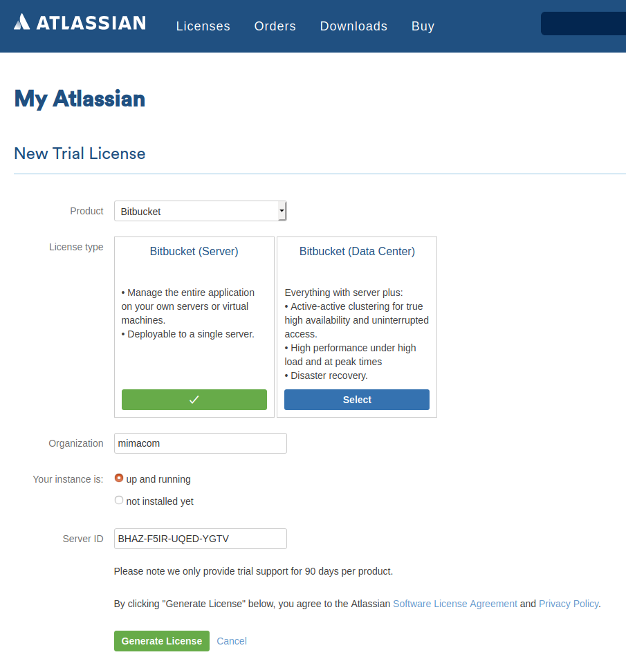
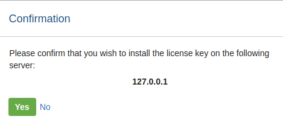
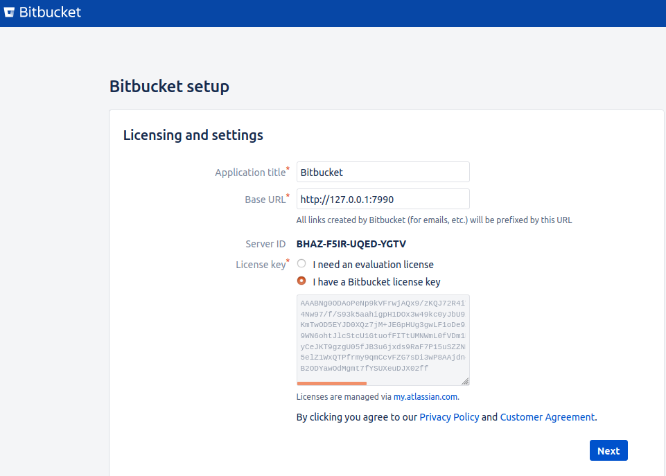
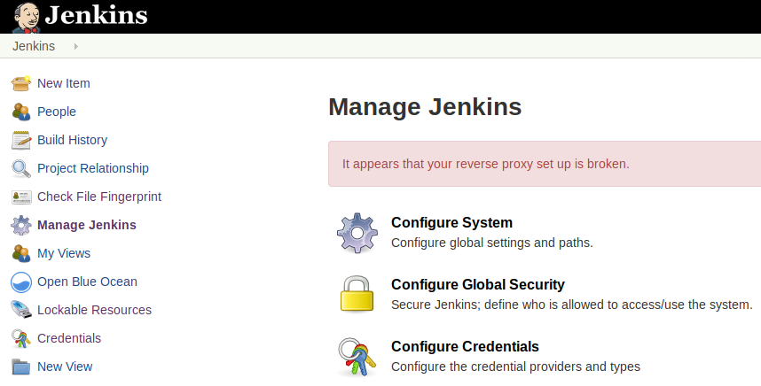
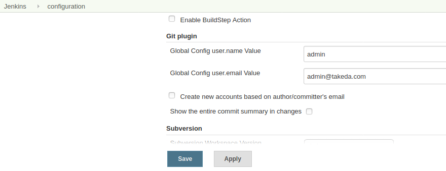
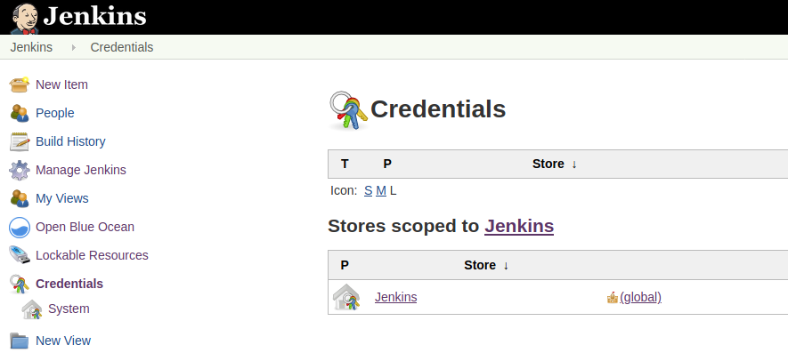
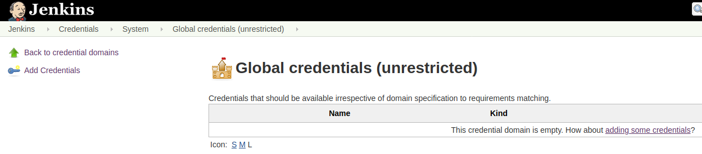
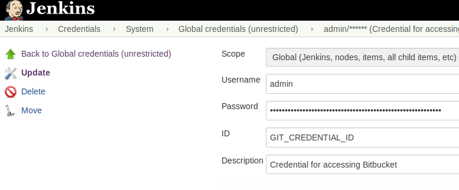

=== Setup Bitbucket

. Point you browser to http://127.0.0.1:7990[http://127.0.0.1:7990]
+

:figure-caption!:
.Bitbucket being a commercial product, it will require a license. As Takeda has already a license, you may acquire a developer license.

+

+

+

+
.User name and password (we suggest password for the password)
image::bitbucket/user.png[]

. You are ready with Bitbucket

==== Connecting Jenkins with Bitbucket

. Go to Jenkins http://127.0.0.1:8080[http://127.0.0.1:8080]
. Git plugin
+

+

. Connecting to git (Bitbucket) also requires credentials
+
.Select global

+
.The credentials must match a user in Bitbucket

+

+
The id `GIT_CREDENTIAL_ID` must be exact, as this id will be used in the scripts.
