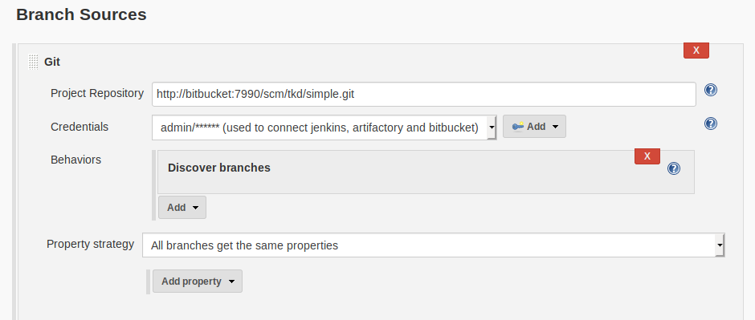

== Jenkins

=== Configure Jenkins

==== Plugins

Some plugins are needed for running the pipelines

* Pipeline Utility Steps
+
Used for extracting the pom's project version

==== Configure System

Go to Manage Jenkins -> Configure System

image::jenkins/configure-jenkins.png[Configure system]

==== Global Library

Configure the Global Pipeline Libraries

This is the libraries used for the pipeline. I.e. scripts are located there

image::jenkins/global-pipeline-libraries.png[Library config]
The library name `pipeline-shard` is used in the jenkins file!
So make sure the name is correct.
We stored the lib at: `https://package-repo.mypkfit.com/bitbucket/scm/inf/build-pipeline.git`
We should have some system user for accessing the repository. In the picture, this is my personal login.

=== Configure the Pipeline

. Create multi branch pipeline
. Configure branch sources
+

. Add environment variables
+
image::jenkins/env-variables.png[Jenkins environmnet variables]
+
The two environment variables must appear for the pipeline to work.
