= Jenkins

== Configure Jenkins

=== Plugins

Some plugins are needed for running the pipelines

* Pipeline Utility Steps
+
Used for extracting the pom's project version
* SonarQube Scanner
+
For perfoming source code analysis

=== Configure System

Go to Manage Jenkins -> Configure System

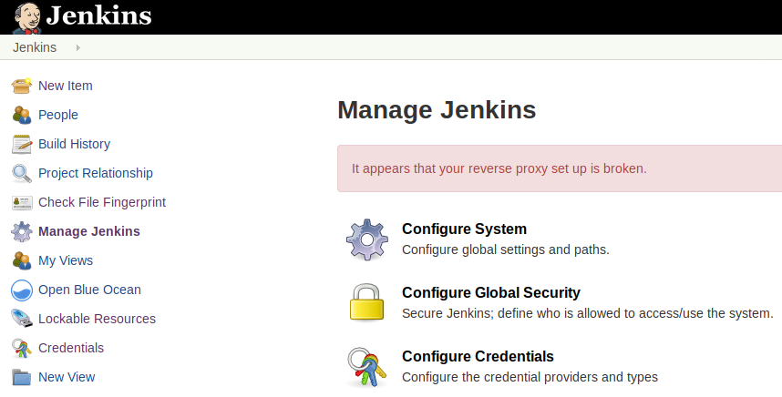

=== Configure SonarQube

See https://medium.com/@rosaniline/setup-sonarqube-with-jenkins-declarative-pipeline-75bccdc9075f[this blog]
and https://medium.com/@theopendle/github-jenkins-sonarqube-integration-for-java-maven-4-4-code-analysis-with-sonarqube-da569db417b6[this one]

. SonarQube authentication Token is generated by SonarQube
+
To get the server authentication token, login to SonarQube and go to Administration -> Security -> Users and then click on Tokens.
There, Enter a Token name and click on Generate and copy the token value and paste it in the Jenkins field and then click on “Done”.
+
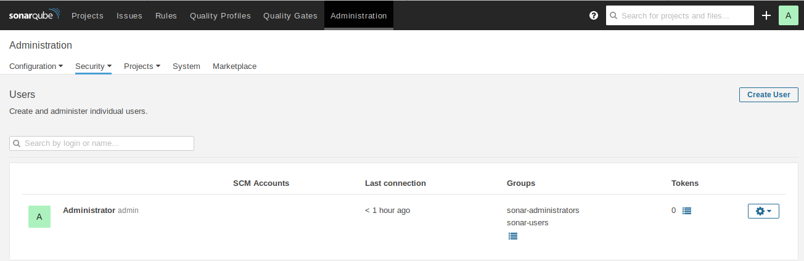
+
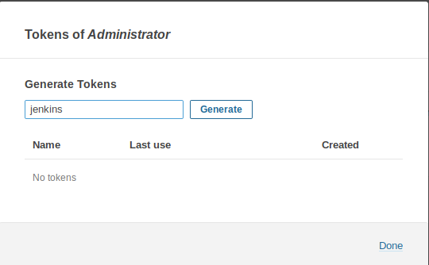
+
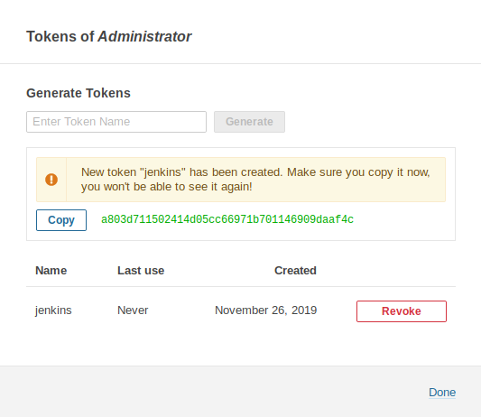

. Configure Jenkins SonarQube's plugin
+
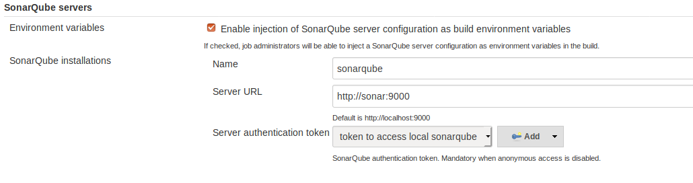
+
The authentication token must be saved as a `Secret Text` credential
. Configure SonarQube's scanner
+
Go to Manage Jenkins -> Global Tool Configuration -> SonarQube Scanner -> SonarQube Scanner installations.
+
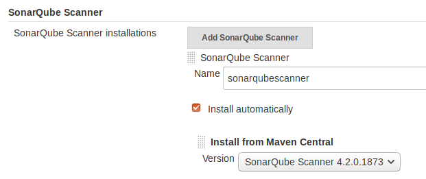

. For local dev, SonarQube is empty, which mean, you will have to set it up.
.. Admin-> Marketplace
+
install the quality profile you need

=== Global Library

Configure the Global Pipeline Libraries

This is the libraries used for the pipeline. I.e. scripts are located there

image::jenkins/global-pipeline-libraries.png[Library config]
The library name `pipeline-shard` is used in the jenkins file!
So make sure the name is correct.
We stored the lib at: `https://package-repo.mypkfit.com/bitbucket/scm/inf/build-pipeline.git`
We should have some system user for accessing the repository. In the picture, this is my personal login.

=== Configure Git

Git plugin

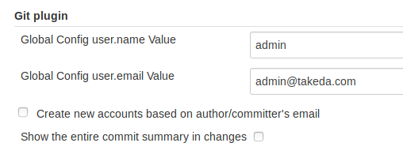

Connecting to git (Bitbucket) also requires credentials to log into the server

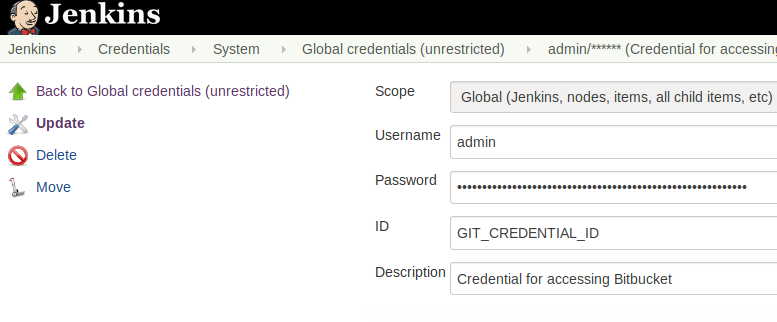
The id `GIT_CREDENTIAL_ID` must be used.

== Configure the Pipeline

. Create multi branch pipeline
. Configure branch sources
+
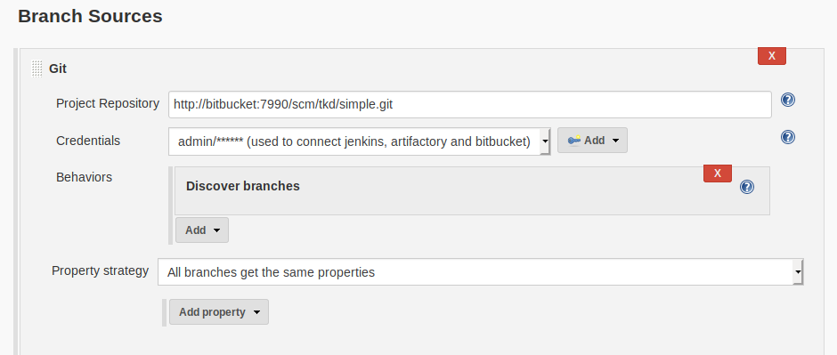

. Settings xml
+
Add settings.xml as a config file
+
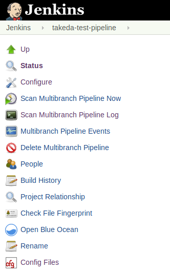
+
Add a `Maven settings.xml` file type.
Give an Id `global-settings-xml`.
The settings file is used for deploying to artifactory.
You will need it later on.
+
The settings.xml file must look like

    <settings xmlns="http://maven.apache.org/SETTINGS/1.1.0"
        xmlns:xsi="http://www.w3.org/2001/XMLSchema-instance"
        xsi:schemaLocation="http://maven.apache.org/SETTINGS/1.1.0 http://maven.apache.org/xsd/settings-1.1.0.xsd">
        <servers>
            <server>
                <id>artifactoryId</id>
                <username>admin</username>
                <password>password</password>
            </server>
        </servers>
    </settings>
+
The artifactoryId `artifactoryId` is used in the deploy script.

. Add environment variables
+
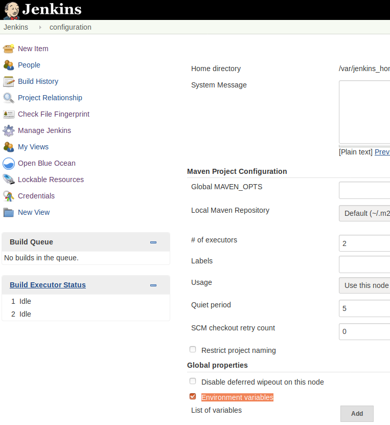
+
The two environment variables must appear for the pipeline to work.
