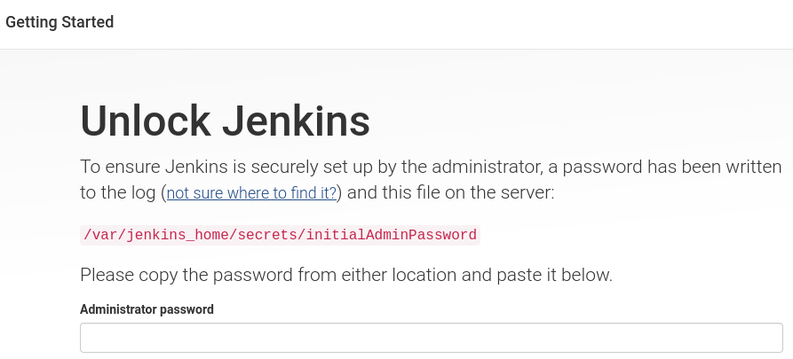
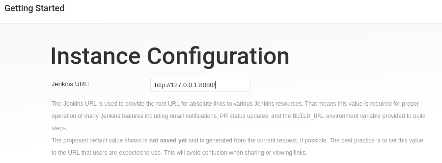
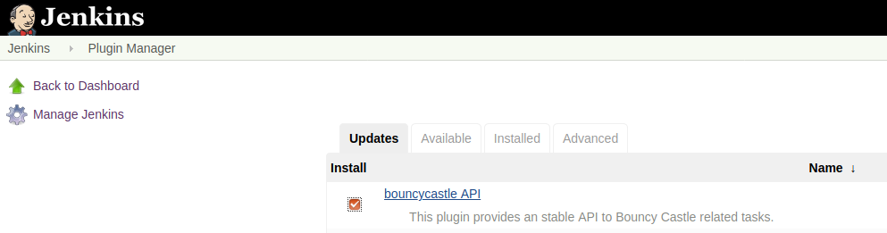
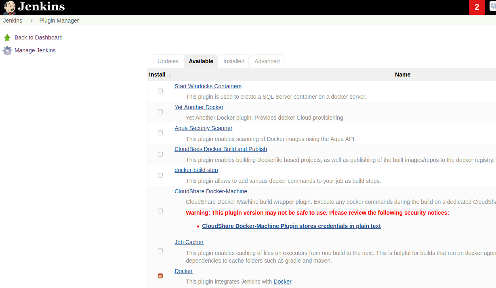
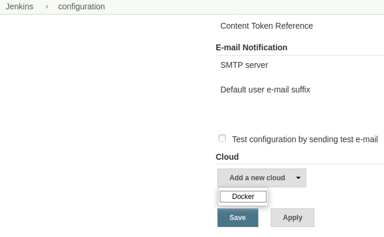
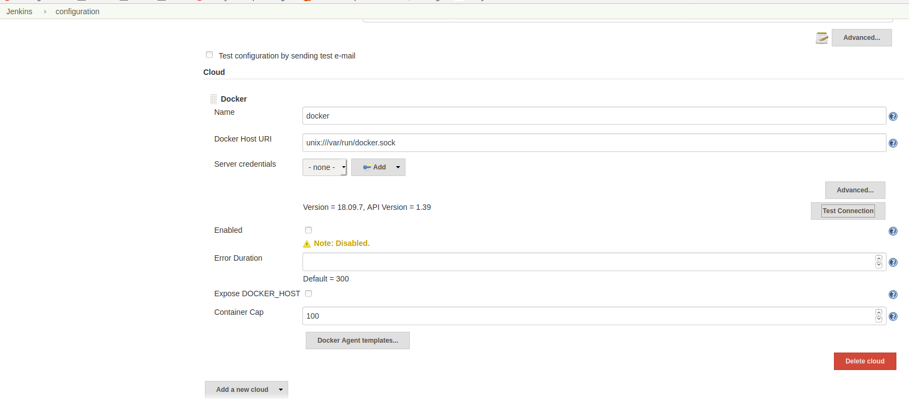

=== Set up Jenkins

. Point you browser at http://127.0.0.1:8080/[http://127.0.0.1:8080/].
At initial startup, note the password from the logs to unlock Jenkins
+

+
----
jenkins        | *************************************************************
jenkins        | *************************************************************
jenkins        | *************************************************************
jenkins        |
jenkins        | Jenkins initial setup is required. An admin user has been created and a password generated.
jenkins        | Please use the following password to proceed to installation:
jenkins        |
jenkins        | 5bdc23daa10041f8abb762118457e65c
jenkins        |
jenkins        | This may also be found at: /var/jenkins_home/secrets/initialAdminPassword
jenkins        |
jenkins        | *************************************************************
jenkins        | *************************************************************
jenkins        | *************************************************************
----

. Install suggested plugins
+

. Create admin user
+
User name: admin / password
+

. Leave url as is.
+

. Restart
. You are set
+

. Install bouncycastle API (The plugin is needed for docker)
+

. install docker plugin
+

+
Configure Docker
+
image::jenkins/configure-jenkins.png[Configure Jenkins]
+

+
:figure-caption!:
.Add `unix:///var/run/docker.sock` to the Docker Host Uri

+
Test your connection.
You should see somthing like: `Version = 18.09.7, API Version = 1.39`

. Save