=== Sonar

See https://medium.com/@rosaniline/setup-sonarqube-with-jenkins-declarative-pipeline-75bccdc9075f[this blog]
and https://medium.com/@theopendle/github-jenkins-sonarqube-integration-for-java-maven-4-4-code-analysis-with-sonarqube-da569db417b6[this one]

==== Initial configuration

. Point you browser to http://127.0.1:9000[http://127.0.1:9000]
. Default loging is admin/admin
+
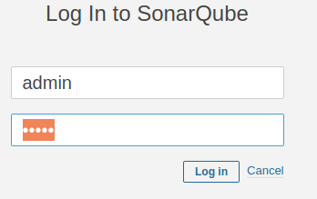
. You will have to install a few plugins Log in and go to Administration -> Marketplace and install
+
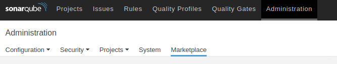
+ Install the plugins.
These are the minimum (You could check with the current installation)
.. Git
.. Clover
+
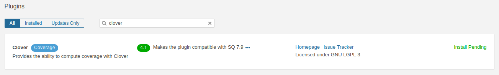
+
.. SonarJava
+
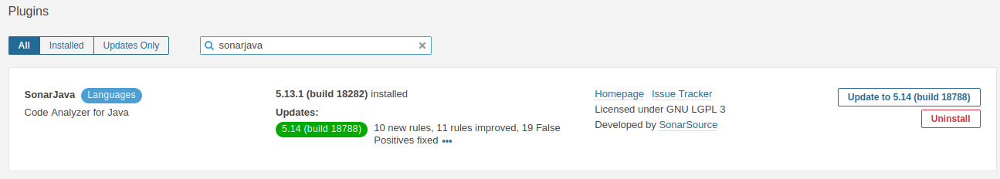
.. Findbugs
+
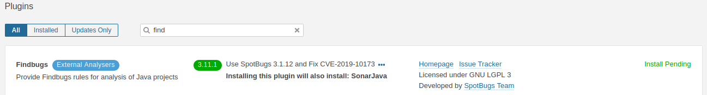
. Restart the server

==== Connect SonarQube with Jenkins

A SonarQube authentication Token is generated by SonarQube

. Go to Administration -> Security -> Users
+
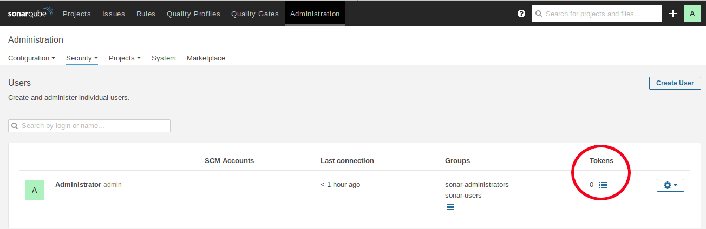
. Click on Tokens and enter a token name
+
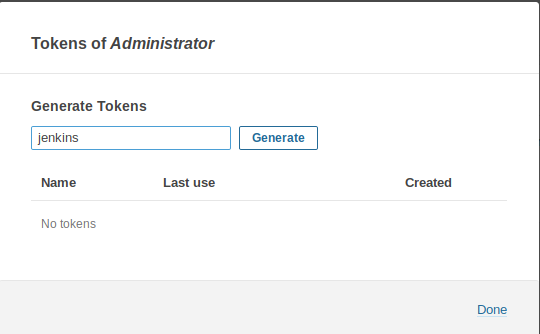
+
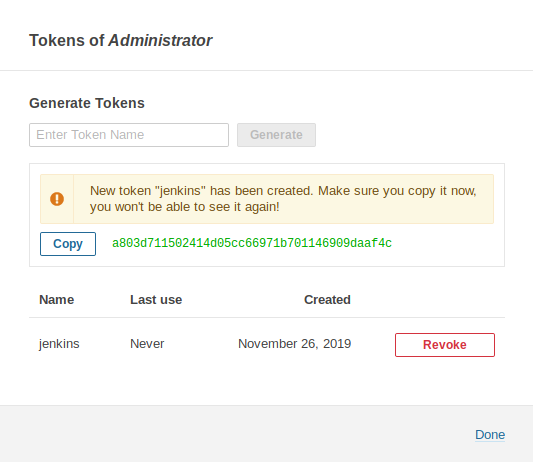

Instll Jenkins SonarQube's plugin

. Install the Jenkins plugin
+
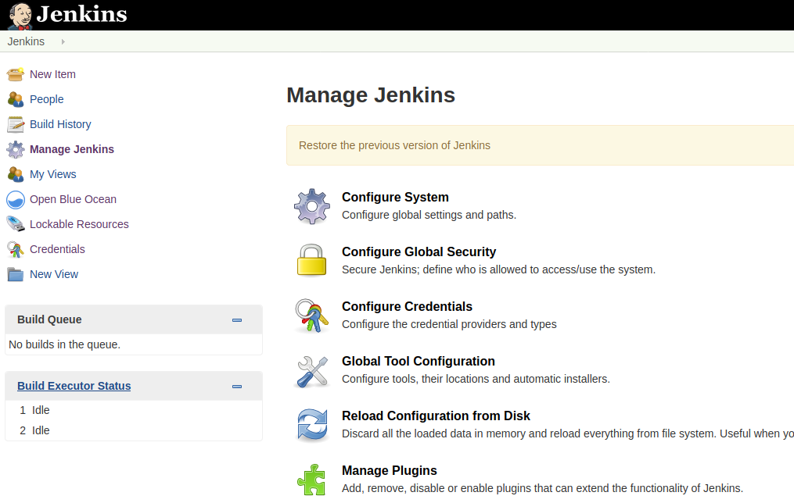
+
:figure-caption!:
.SonarQube Scanner
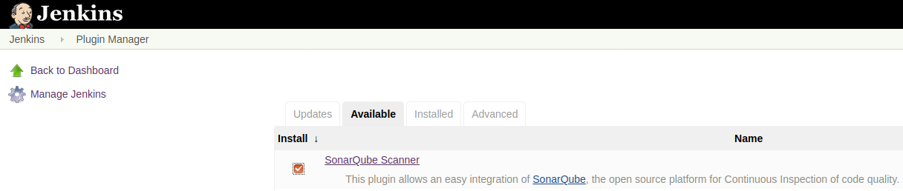

Create credentials for SonarQube

. Go to credentials
+
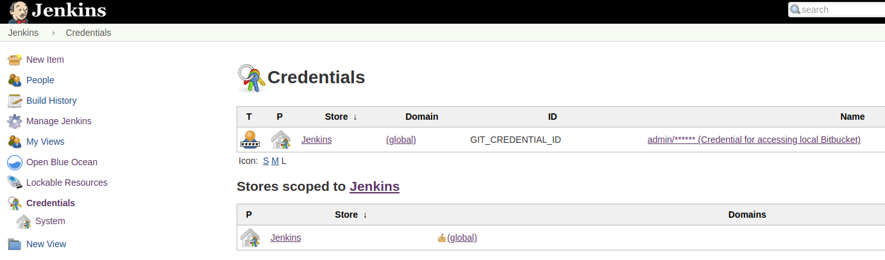

. Select global
. Add credentials
+
image::sonar/add-credentials.png[]

. Add credentials as secret text
+
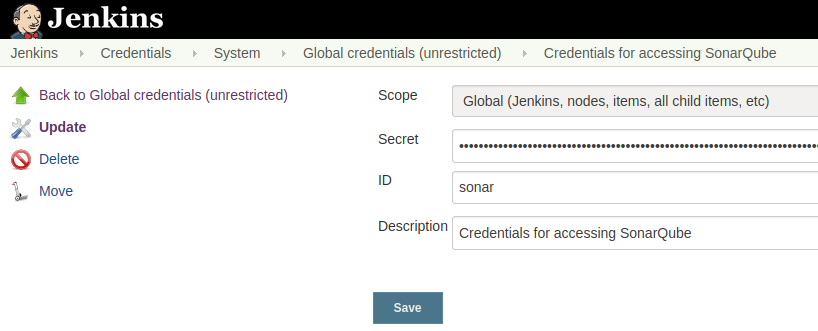

Configure the plugin

. Go to Configure Jenkins
+
image::jenkins/configure-jenkins.png[]

. Configure the plugin
+
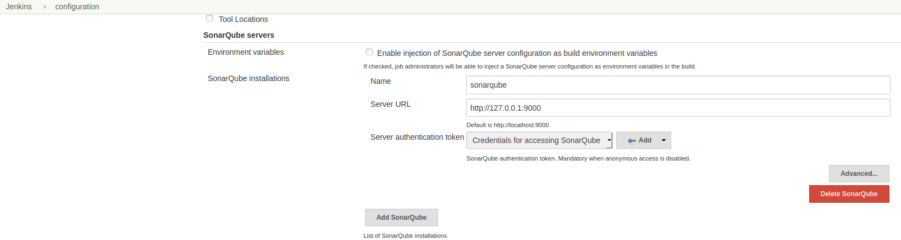
+
The `sonarqube` name will be used in scripts.

. Configure SonarQube's scanner

.. Go to Manage Jenkins -> Global Tool Configuration
+
image::sonar/global-tool-config.png[]
. SonarQube Scanner
+
Add SonarQube Scanner
+
.The name `sonarquebescanner` will be used in scripts.
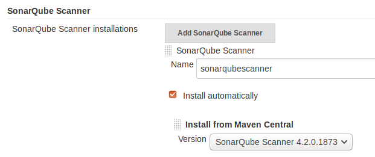

